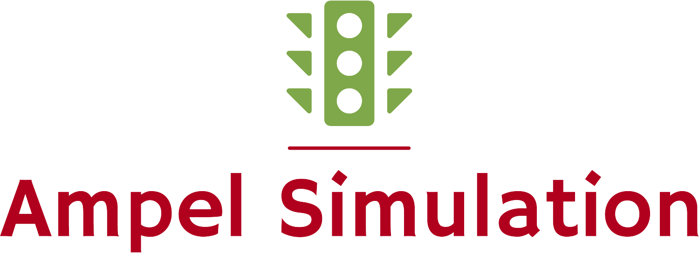

 
  

<h1 align="center">Lazarevic_project_2</h1>

<h4 align="center"> 
	Communication between 2 Trafficlight and Load balance system
</h4> 

 

  <a class="bg-yellow" href="#open_book-about">About</a> |
  <a href="#desktop_computer-technologies">Technologies</a> &#xa0; | &#xa0;
  <a href="#gear-requirements">Requirements</a> &#xa0; | &#xa0;
  <a href="#arrow_forward-execution">Execution</a> &#xa0; | &#xa0;
  <a href="#balance_scale-license">License</a> &#xa0; | &#xa0;
  <a href="https://github.com/VLazarevic" target="_blank">Author</a>

 

## :open_book: About ##

This project consists of two traffic light systems that communicate with each other. They send cars between them. There is also load balancing. The traffic lights take a longer time for the queue to work through. Further features will be added later in the project.

## :desktop_computer: Technologies ##

The following tools were used in this project:

- [C++]
- [Meson](https://mesonbuild.com/)
- [:books: spdlog](https://github.com/gabime/spdlog)
- [:books: asio](https://think-async.com/Asio)
- [:books: json](https://github.com/nlohmann/json)
- [:books: CLI11](https://github.com/CLIUtils/CLI11)

Additional tools may be added during the course of the project. 

## :gear: Requirements ##

To start the Project, you must have all technologies included.

## :arrow_forward: Execution ##

# Clone this project
$ git clone https://github.com/VLazarevic/lazarevic_project_2

# Access
$ cd Lazarevic_project_2

# Go into /build
$ cd build

# Build the project
$ meson ..

# Compile the project
$ ninja

# Execute -help to see the parameter and their description
$ ./trafficlight-sim -help

# Execute with parameter for example
$ ./trafficlight-sim 5 5 50

## :balance_scale: License ##

This project is under Boost License

&#xa0;

<a href="#top">Back to top</a>
